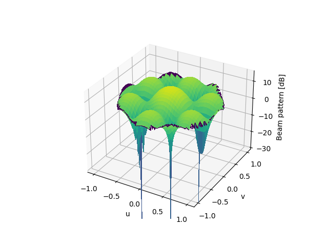

# pycrb
A Pythonic library for antenna array analysis and optimization



### Usage
Folder ```examples``` contains some examples on how to use the different modules.

### Dependencies
Run ```python -m pip install -r requirements.txt``` to install the dependencies.

---

## References
<a id="1">[1]</a>
Van Trees, H. L. (2004). Optimum Array Processing: Part IV of Detection, Estimation, and Modulation Theory. Germany: Wiley.
